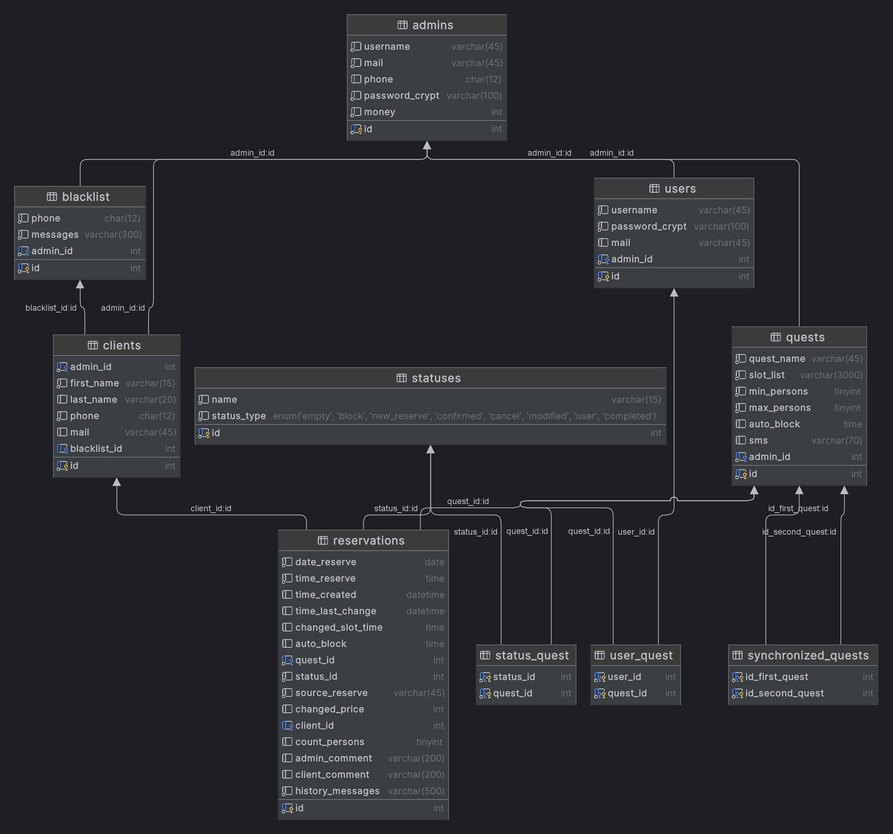

# Система бронирования квестов: Web Application (demo)

## Приложение включает:
+ Разный уровень доступа и редактирования 
+ Создание схемы слотов для бронирования
+ Частичное или общее изменение слотов
+ История изменений с указанием автора

## Stack:
```
Java, MySQL, Spring Boot, Spring Data JPA, Hibernate, Spring Security, 
Spring MVC, Thymeleaf, BootStrap, Docker
```
***

### Сделанная часть: 
Взаимодействие с БД, валидация в серверном слое, 
основная логика программы


### В разработке: 
Front-end, логгирование, security
***

## Схема БД:


***

### Сервер:
>__Сборка:__
MySQL и Spring Boot в двух отдельных Docker контейнерах на общей сети (network)
> 
>__Ссылка на сервер:__ 
[quest reservations](http://31.129.99.231:8080/slot-list)
> 
>__Логин/пароль:__ admin

