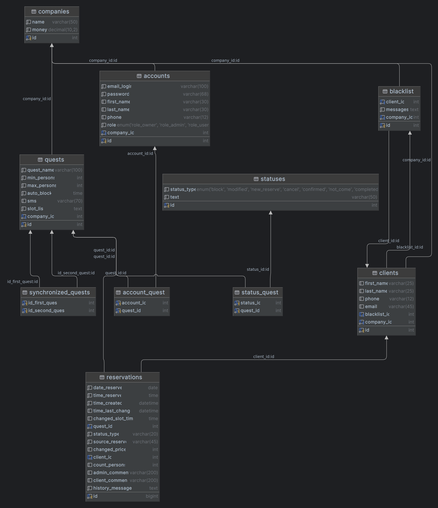

# Система бронирования квестов: Web Application (alpha)

## Особенности приложения:
+ Приложение B2B SaaS 
+ Возможность создания схемы квеста
+ Управление пользователями
+ Сохранение и мониторинг клиентов
+ Подсчёт и контроль финансов
+ Ролевая модель
+ API для внешней интеграции

## Stack:
```
Java 21, Spring Boot 3, PostgreSQL, Spring Data JPA, Hibernate ORM, FlyWay,
Spring Security, Spring MVC, Hibernate Validator, H2, Thymeleaf, BootStrap, Docker
```
***

## Схема Database:


***

### Сервер:
>__Сборка:__
PostgreSQL, Redis и Spring Boot через Docker-compose
> 
>__Ссылка на сервер:__ 
> <a href="http://99152dd5cacb.vps.myjino.ru" target="_blank">http://99152dd5cacb.vps.myjino.ru</a>